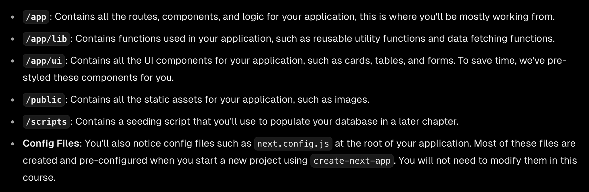

# next.js
### 一、项目结构 

### 二、路由
next.js的路由是通过创建不同的pages来实现，通过创建不同的文件夹，在里边放置page文件来实现

### 三、渲染
#### 3.1 静态渲染

### 四、搜索查询
1. useSearchParams() hook 和 searchParams 对比
   一般认为 "use client" 是use关键字useSearchParams
   而searchParams是服务端
2. Debouncing防抖动   
   Debouncing is a programming practices that limits the rate at which a function fire.
   目的:
   By debouncing, you can reduce the number of requests sent to your database, thus saving resources.
   

